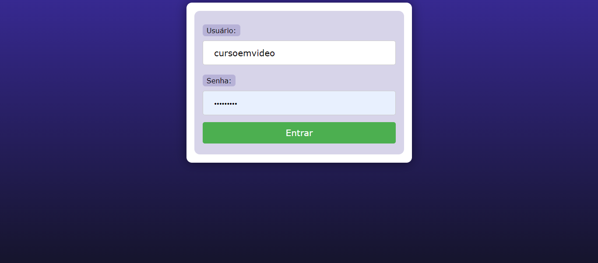
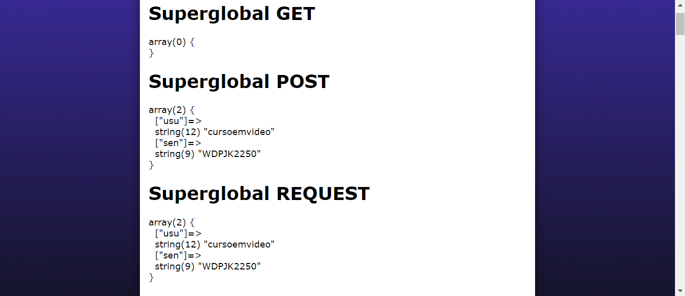

# SUPERGLOBAIS COM PHP
👨‍🏫PROJETO CRIADO PARA O CURSO DE PHP DO CURSO EM VIDEO.

  
  

## DESCRIÇÃO:
O projeto consiste em duas páginas HTML que interagem com o PHP para demonstrar o uso das superglobais em PHP, como `$_GET`, `$_POST`, `$_REQUEST`, `$_COOKIE`, `$_SESSION`, `$_ENV`, `$_SERVER` e `$GLOBALS`.

## EXECUTANDO O PROJETO:
1. **Executando o Aplicativo:**
   - Coloque os arquivos em um servidor web compatível com PHP (por exemplo, XAMPP, WAMP, LAMP).
   - Acesse o formulário no navegador visitando `http://localhost/CODIGO/index.html`.

2. **Interagir com o Projeto:**
   1. **Página de Login (`index.php`):**
   
      Esta página contém um formulário de login onde o usuário pode inserir seu nome de usuário e senha. Para usar:
      
      - Abra o arquivo `index.php` em um navegador da web.
      - Insira o nome de usuário e senha nos campos correspondentes.
      - Clique no botão "Entrar".
      
      Este formulário envia os dados para a página `superglobais.php` usando o método POST.

   2. **Página de Exibição de Superglobais (`superglobais.php`):**
      
      Esta página recebe os dados do formulário de login da página anterior e exibe informações sobre as superglobais do PHP. Para usar:
      
      - Após inserir o nome de usuário e senha na página de login, clique no botão "Entrar".
      - A página `superglobais.php` será carregada, exibindo informações sobre as superglobais PHP.
      
      As informações exibidas incluem dados enviados por meio dos métodos POST e outras informações de ambiente como cookies, sessões, dados do servidor, etc. Os dados são exibidos usando a função `var_dump()` para visualização detalhada.

## CREDITOS:
- [PROJETO CRIADO PARA O CURSO DE PHP](https://github.com/VILHALVA/CURSO-DE-PHP)
- [PROJETO FEITO PELO VILHALVA](https://github.com/VILHALVA)

